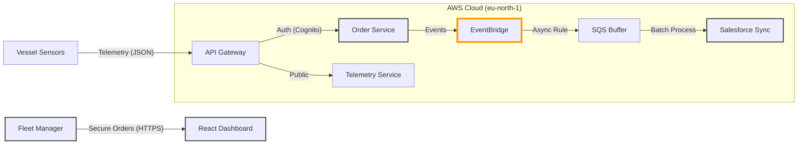
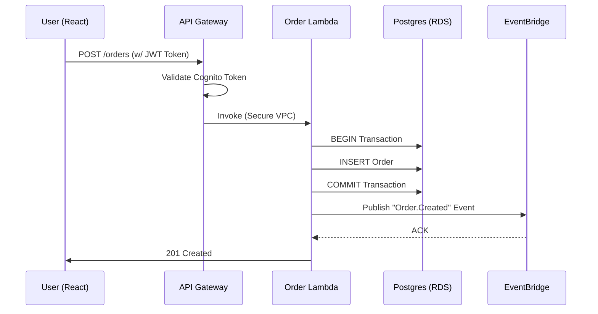

# Nexus-Marine: Enterprise Cloud-Native Logistics Platform

> **Next-Gen B2B Marine Portal: Connecting Serverless Order Management with Event-Driven Orchestration.**

[](https://youtu.be/PLACEHOLDER_VIDEO_ID)

> **[Watch the Architectural Demo](https://youtu.be/PLACEHOLDER_VIDEO_ID)** featuring EventBridge Decoupling, Hybrid Compute (Lambda + Docker), and Cognito Security.


**Nexus-Marine** is a full-stack, enterprise-grade cloud platform designed for industrial B2B ecosystem. It bridges the gap between high-frequency vessel telemetry and secure supply chain operations, utilizing a Serverless First architecture for infinite scalability and zero-maintenance overhead.

---

## 1. Executive Summary & Business Value

Traditional maritime logistics systems are monolithic, slow, and prone to downtime. Nexus-Marine modernizes this stack to ensure 24/7 availability and real-time data ingestion.

| KPI | Operational Challenge | Nexus Architecture Solution |
| :--- | :--- | :--- |
| **Scalability & Cost** | Legacy servers incur high costs for idle time. | **Serverless Compute (Lambda)** scales to zero when unused and handles burst traffic automatically. |
| **Data Integrity** | Order failures in monolithic systems result in lost revenue. | **Event-Driven Design (EventBridge)** ensures guaranteed delivery. If Salesforce is down, orders queue in **SQS DLQs** for retry. |
| **Security** | Public endpoints expose sensitive pricing data. | **AWS Cognito & API Gateway** provide military-grade OAuth2/OIDC authentication for order placement. |

---

## 2. System Architecture (C4 Model)

We utilize a **Hexagonal Architecture** (Ports & Adapters) pattern to decouple business logic from AWS services, ensuring testability and portability.

### Level 1: System Context
The data flow from the Vessel/Operator to the Cloud.



### Level 2: Data & Control Flow
How we handle High-Velocity Telemetry vs. High-Value Orders.



---

## 3. Architecture Decision Records (ADR)

Strategic choices made to balance Performance, Security, and Maintainability.

| Component | Decision | Alternatives Considered | Justification (The "Why") |
| :--- | :--- | :--- | :--- |
| **Infrastructure** | **AWS CDK (TypeScript)** | Terraform / SAM | **Type Safety:** CDK allows us to share types between our Backend code and Infrastructure definitions, reducing configuration errors significantly. |
| **Database** | **Polyglot (Dynamo + RDS)** | Single DB | **Optimization:** Telemetry is high-volume/simple-access (DynamoDB is perfect). Orders are relational/transactional (PostgreSQL is required for ACID compliance). |
| **Decoupling** | **Amazon EventBridge** | SNS / Kafka | **Schema Registry:** EventBridge allows mostly schema-less routing and easier integration with third-party SaaS (Salesforce) compared to SNS. Kafka was overkill for this throughput. |

---

## 4. Reliability & Security Strategy

### Enterprise Security (Zero Trust)
* **Identity Management:** All administrative actions require authentication via **AWS Cognito**. The React frontend uses **AWS Amplify Authenticator** to handle JWT token rotation automatically.
* **Least Privilege:** Lambda functions are assigned IAM roles that grant access *only* to the specific DynamoDB tables or Event Buses they need.
* **Network Isolation:** The Order Service runs inside a **VPC Private Subnet**, accessible only via the API Gateway, preventing direct public internet access to the Database.

### Failure Modes & Recovery
* **Database Failure:** The Order Service implements a `try/catch/rollback` block. If the EventBridge publish fails, the SQL transaction is rolled back to maintain consistency.
* **Integration Outage:** If the downstream CRM (Salesforce Mock) is offline, messages accumulate in an **SQS Queue**. If processing fails 3 times, they move to a **Dead Letter Queue (DLQ)** for human review, ensuring zero data loss.

---

## 5. Evaluation Framework (QA)

We employ a strict **Test-Driven Development (TDD)** approach with 100% coverage requirements.

* **Unit Testing (Jest):** Mocks AWS SDKs (`aws-sdk-client-mock`) to verify business logic without hitting real cloud resources.
* **Infrastructure Testing (CDK Assertions):** Verifies that the synthesized CloudFormation templates contain encrypted Databases and correct IAM policies.
* **Integration Testing:** Live deployment verification via the `make deploy` pipeline.

---

## Tech Stack

### Core & Compute
-   **Runtime:** Node.js 20 (ES Modules)
-   **Language:** TypeScript 5.x
-   **Compute:** AWS Lambda & Docker (Hybrid capability)
-   **Orchestration:** Amazon EventBridge

### Data & Storage
-   **NoSQL:** Amazon DynamoDB (Telemetry)
-   **Relational:** Amazon RDS (PostgreSQL)
-   **Queues:** Amazon SQS (Standard & DLQ)

### Frontend
-   **Framework:** React 18, Vite
-   **Styling:** Tailwind CSS v3
-   **Auth:** AWS Amplify UI Components
-   **Hosting:** Amazon S3 + CloudFront (CDN)

### DevOps
-   **IaC:** AWS Cloud Development Kit (CDK)
-   **CI/CD:** GitHub Actions
-   **Monitoring:** Amazon CloudWatch Dashboards & Alarms

---

## Getting Started

### Prerequisites

-   Node.js v20+
-   AWS CLI (Configured)
-   Docker Desktop (For container builds)

### Installation

1.  **Clone the repository**
    ```bash
    git clone https://github.com/Nibir1/Nexus-Marine.git
    cd Nexus-Marine
    ```

2.  **Install Dependencies**
    ```bash
    make install
    ```

3.  **Deploy to AWS**
    This command bootstraps the CDK environment and deploys all stacks (DB, Event, API, Frontend).
    ```bash
    make deploy
    ```

### Testing & Validation

This project maintains **100% Test Coverage**. We use a unified Makefile to run tests for both the backend logic and the infrastructure definitions.

The testing suite includes:
-   **Service Logic:** Verifies SQL transactions and Event publishing.
-   **Infrastructure Security:** Asserts that Public Access is disabled on Databases.
-   **ESM Compatibility:** Ensures Node.js modules load correctly.

To run the full test suite with clean output:

```bash
make test
```

### Advanced: Container Verification

While the production stack uses efficient Node.js Lambdas, the architecture is fully container-ready. You can prove the Docker build capability for the Order Service:

```bash
make docker-proof
```

---

## Project Structure

```text
Nexus-Marine/
├── .github/workflows/       # CI/CD Pipelines
├── backend/                 # Microservices Source Code
│   ├── src/
│   │   ├── orders/          # Transactional Logic (Postgres)
│   │   ├── telemetry/       # High-Speed Ingestion (DynamoDB)
│   │   └── salesforce/      # Async Workers (SQS)
│   ├── test/                # Unit Tests (Jest + AWS Mocks)
│   └── jest.setup.js        # Test Environment Config
├── cdk/                     # Infrastructure as Code
│   ├── lib/                 # Stacks (DB, API, Event, Front)
│   └── test/                # Infrastructure Assertions
├── frontend/                # React Dashboard
│   ├── src/
│   │   ├── App.tsx          # Amplify Auth Wrapper
│   │   └── main.tsx         # Entry Point
│   └── vite.config.ts       # Build Config
└── Makefile                 # Orchestration Scripts
```

## Roadmap
- [x] Cloud-Native Infrastructure (CDK)
- [x] Event-Driven Orders (EventBridge)
- [x] Real-time Telemetry (DynamoDB)
- [x] Enterprise Security (Cognito)
- [x] CI/CD Pipeline (GitHub Actions)
- [ ] Multi-Region Replication (Disaster Recovery)
- [ ] GraphQL API (AppSync) transition

---

## Developer Spotlight
Architected by **Nahasat Nibir** — *Full Stack Engineer & Cloud Architect*